# System Architecture - Unique Staffing Professionals

## High-Level System Architecture

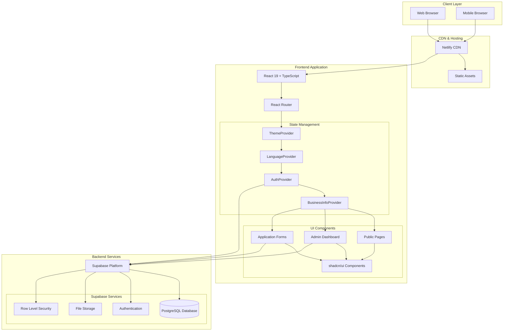

## Application Architecture

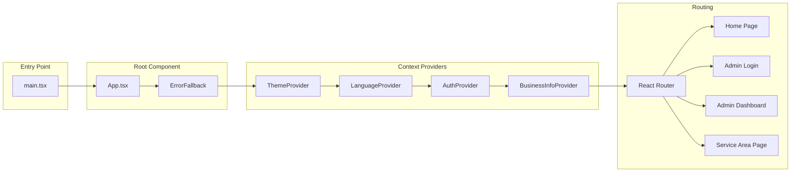

## Data Flow Architecture

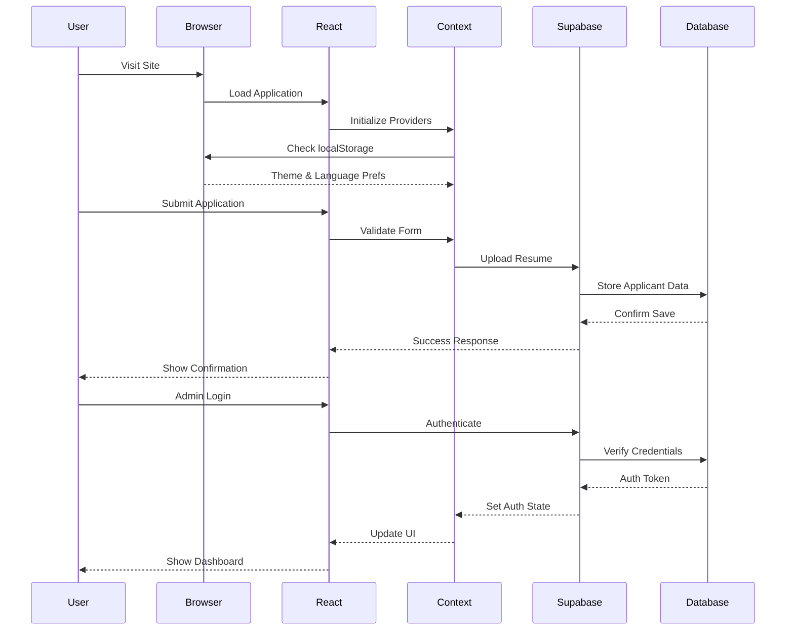

## Component Architecture

```mermaid
graph TD
    subgraph "Page Components"
        HomePage[Home.tsx]
        AdminPage[AdminDashboard.tsx]
        LoginPage[AdminLogin.tsx]
        ServicePage[ServiceAreaPage.tsx]
    end
    
    subgraph "Feature Components"
        Hero[Hero Section]
        Services[Services Section]
        Industries[Industries Section]
        WhyUs[Why Choose Us]
        Testimonials[Testimonials]
        Contact[Contact Section]
        ApplyForm[Application Form]
    end
    
    subgraph "Admin Components"
        Analytics[AnalyticsDashboard]
        ApplicantList[ApplicantList]
        ApplicantDetail[ApplicantDetail]
        BizManager[BusinessInfoManager]
    end
    
    subgraph "Shared Components"
        Nav[Navigation]
        Footer[Footer]
        LangToggle[LanguageToggle]
        ThemeToggle[ThemeToggle]
    end
    
    subgraph "UI Primitives"
        Button[Button]
        Card[Card]
        Dialog[Dialog]
        Form[Form]
        Input[Input]
        Select[Select]
        Table[Table]
    end
    
    HomePage --> Hero
    HomePage --> Services
    HomePage --> Industries
    HomePage --> WhyUs
    HomePage --> Testimonials
    HomePage --> Contact
    HomePage --> ApplyForm
    
    AdminPage --> Analytics
    AdminPage --> ApplicantList
    AdminPage --> ApplicantDetail
    AdminPage --> BizManager
    
    Hero --> Nav
    Hero --> LangToggle
    Hero --> ThemeToggle
    
    ApplyForm --> Form
    ApplyForm --> Input
    ApplyForm --> Button
    
    Analytics --> Card
    ApplicantList --> Table
    ApplicantDetail --> Dialog
```

## Database Schema

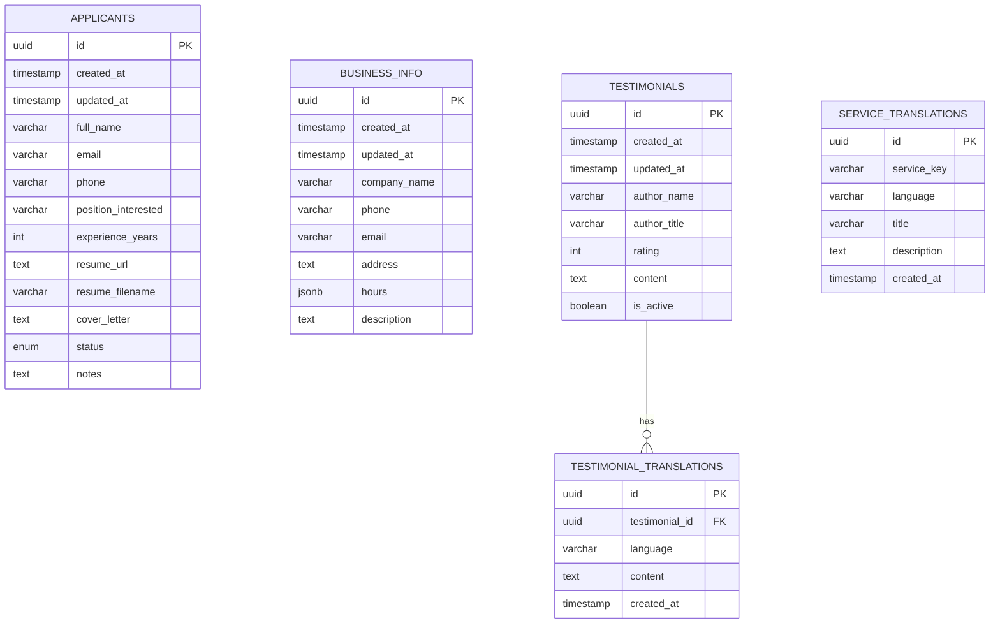

## Authentication Flow

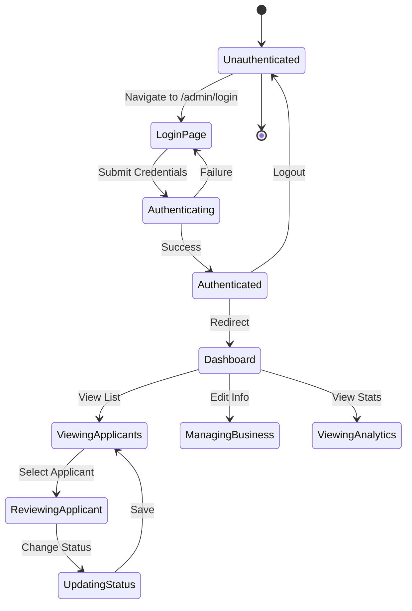

## File Upload Flow

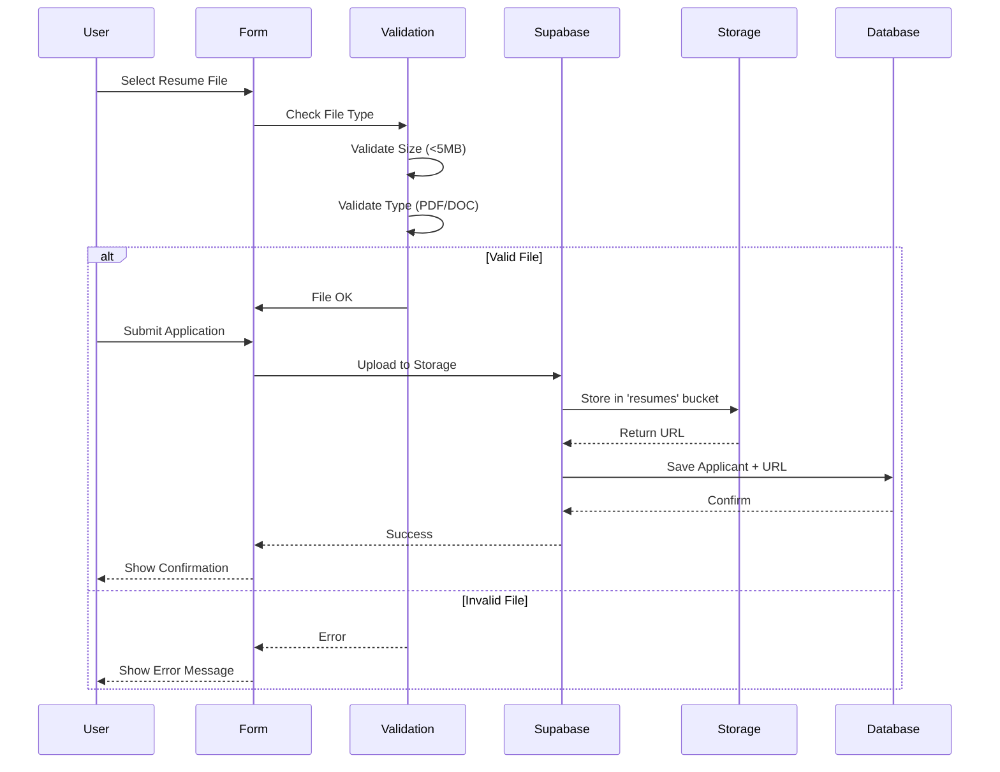

## Internationalization Architecture

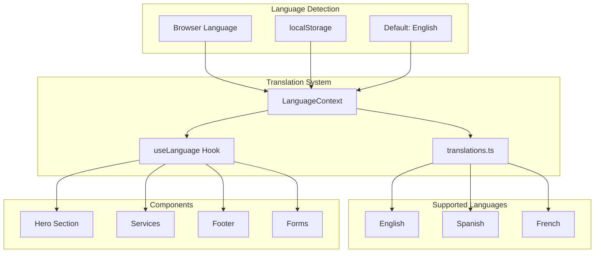

## Theme System Architecture

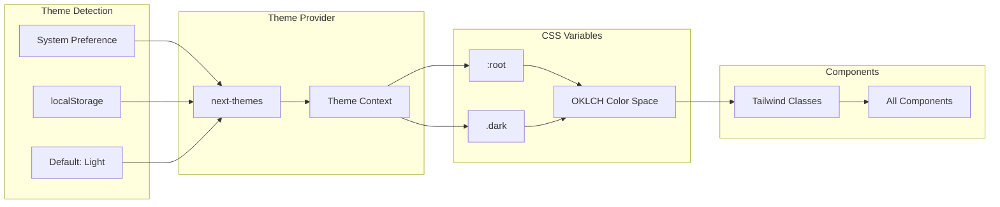

## Security Architecture

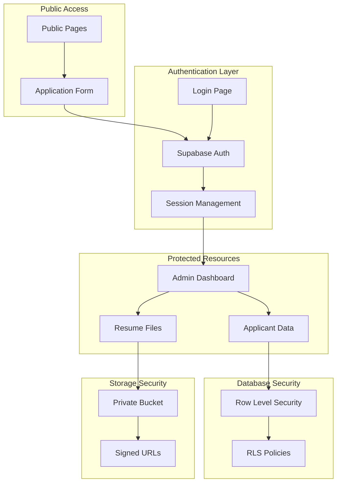

## Deployment Pipeline

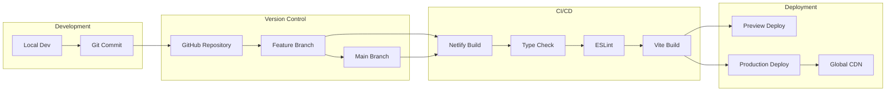

## Performance Optimization

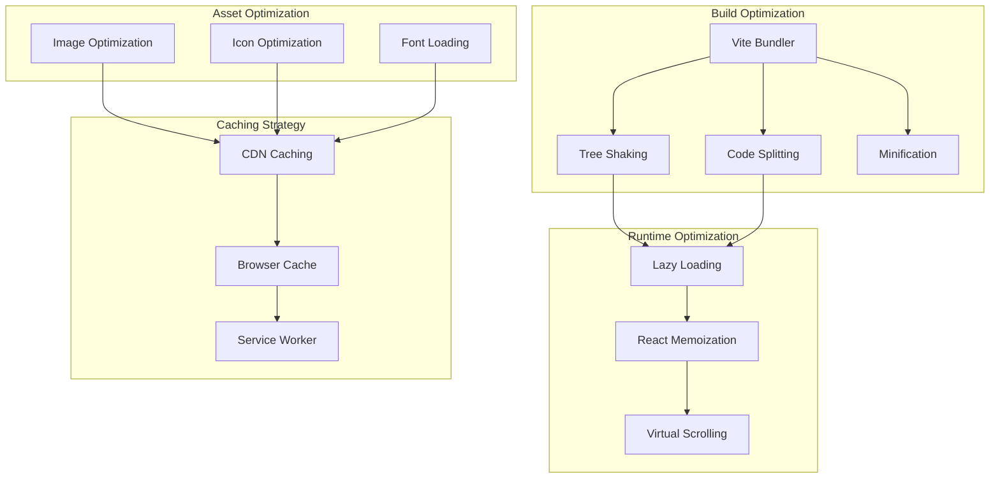

## Monitoring & Observability

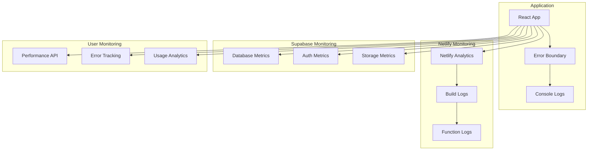

## Technology Stack

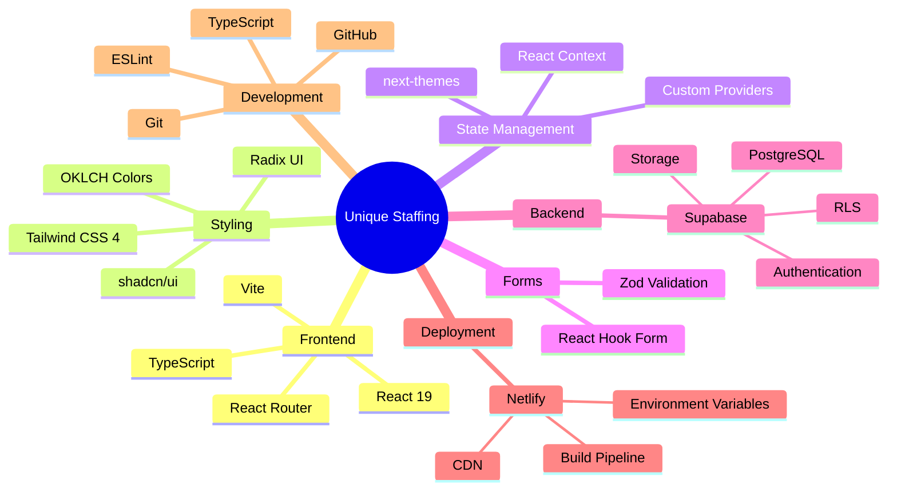

## Key Features Map

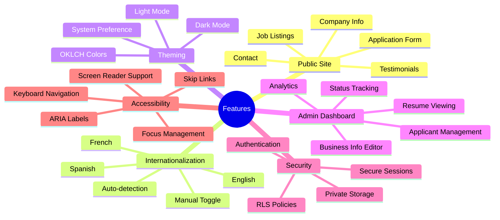

---

**Document Version**: 1.0.0  
**Last Updated**: December 2025  
**Maintained By**: Development Team
